# Visionist

**Visionist**, e-ticaret ve moda vitrinlerine entegre edilebilen, **Gemini 2.5 Flash** destekli akıllı bir stil asistanıdır. Kullanıcılarınızı tanır, beden ve stok kurallarına göre ürünleri süzer, en uygun kombinleri önerir ve sonucu şık bir **Akıllı Kolaj** ile sunar.

Misafir olarak hemen deneyebilirsiniz; hesap açtığınızda tercihleriniz ve kayıtlı kombinleriniz **Supabase** üzerinde güvenle saklanır.

---

## İçindekiler

- [Visionist nedir?](#visionist-nedir)
- [Nasıl çalışır?](#nasıl-çalışır)
- [Kullanıcı yolculuğu](#kullanıcı-yolculuğu)
- [Misafir ve üye farkı](#misafir-ve-üye-farkı)
- [Teknik mimari](#teknik-mimari)
- [Yerel kurulum](#yerel-kurulum)
- [Ortam değişkenleri](#ortam-değişkenleri)
- [Proje yapısı](#proje-yapısı)
- [Ekip](#ekip)

---

## Visionist nedir?

Visionist, “bugün ne giysem?” sorusuna yalnızca metinle değil, **kendi parçanızın fotoğrafıyla** da yanıt veren bir stil asistanıdır. Arka planda:

- **Yerel ürün kataloğu** (fiyat, indirim, beden stoku, mevsim/kullanım etiketleri),
- **FastAPI** ile profil ve stok ön filtresi,
- **Gemini 2.5 Flash** ile renk uyumu ve bütçe dengesi,

bir araya gelir. Model yalnızca **ürün kimliklerini** seçer; görseller ve fiyatlar frontend’de birleştirilir. Böylece hem hızlı hem maliyet açısından verimli bir öneri hattı elde edilir.

---

## Nasıl çalışır?

```text
Kullanıcı (metin veya fotoğraf)
        ↓
   Next.js arayüzü
        ↓
   /api/backend proxy
        ↓
   FastAPI — katalog + profil + stok filtresi
        ↓
   Gemini 2.5 Flash — ürün ID seçimi
        ↓
   Tam kombin kartı + Akıllı Kolaj (Tailwind CSS)
        ↓
   (Üye ise) Supabase — Dolabım’a kayıt
```

1. Onboarding’de toplanan **cinsiyet, yaş grubu, beden ve stil** tercihleri profilinize yazılır.
2. Kombin isteğinde backend, katalogdan size uygun adayları çıkarır.
3. Gemini bu listeden en uyumlu parçaları seçer.
4. Frontend, dönen ID’lere karşılık gelen görselleri grid kolajında gösterir.
5. İsterseniz tek bir parçayı değiştirmek için **parça bazlı güncelleme** yapabilirsiniz.

---

## Kullanıcı yolculuğu

### Adım 1 — Sizin için en uygun kombini bulalım

İlk adımda **cinsiyet** (Kadın / Erkek) ve **yaş grubu** (Çocuk / Genç / Yetişkin) seçilir. Böylece koleksiyon ve görseller size göre kişiselleşir.

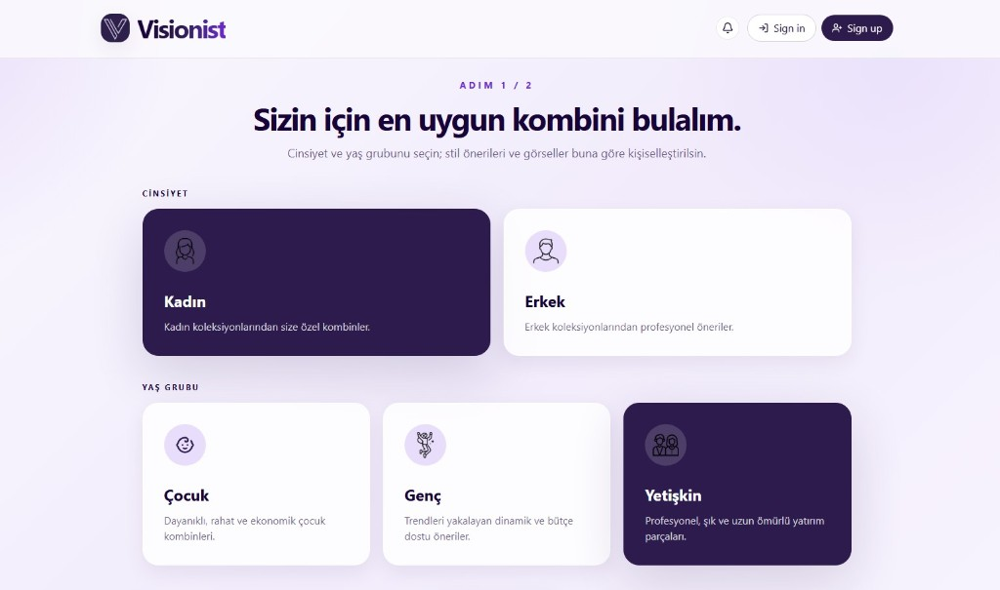

---

### Adım 2 — Sizi biraz daha yakından tanıyalım

İkinci adımda **beden tercihi** (S–XL) ve **stil tercihi** (Klasik, Spor, Günlük, Şık, Vintage, Minimal) belirlenir. Kombin önerilerine yalnızca **stokta olan** ve profilinize uyan bedenler dahil edilir.

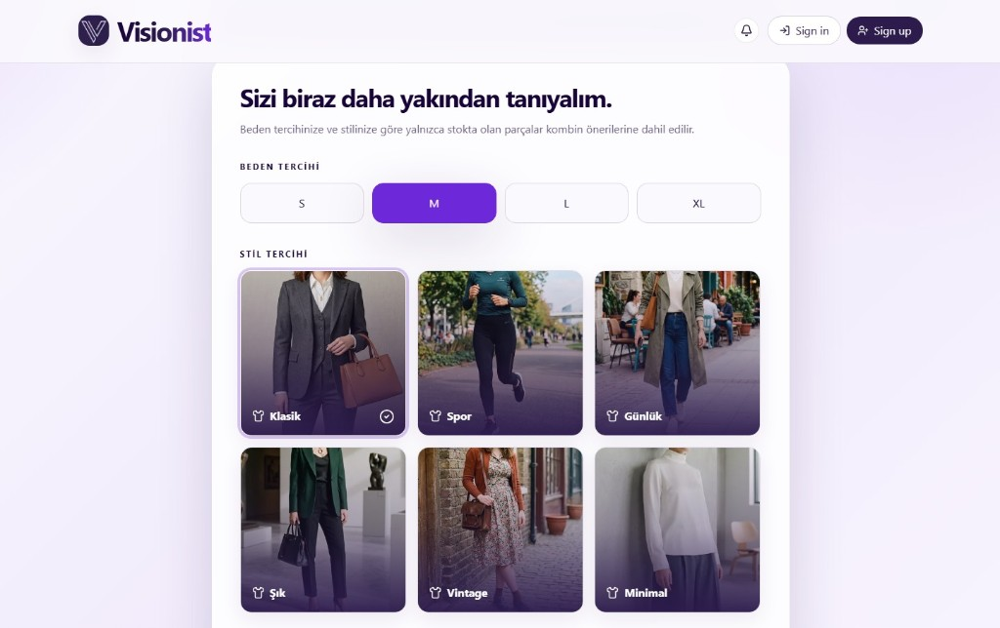

---

### Stil asistanı — metin veya fotoğraf ile kombin

Ana sayfada doğal dilde bir istek yazabilirsiniz (*“Yazlık, uygun fiyatlı bir akşam yemeği kombini”* gibi) veya **“Buna ne uyar?”** ile dolabınızdaki bir parçanın fotoğrafını yükleyebilirsiniz. İlham önerileri hızlı başlamanıza yardım eder.

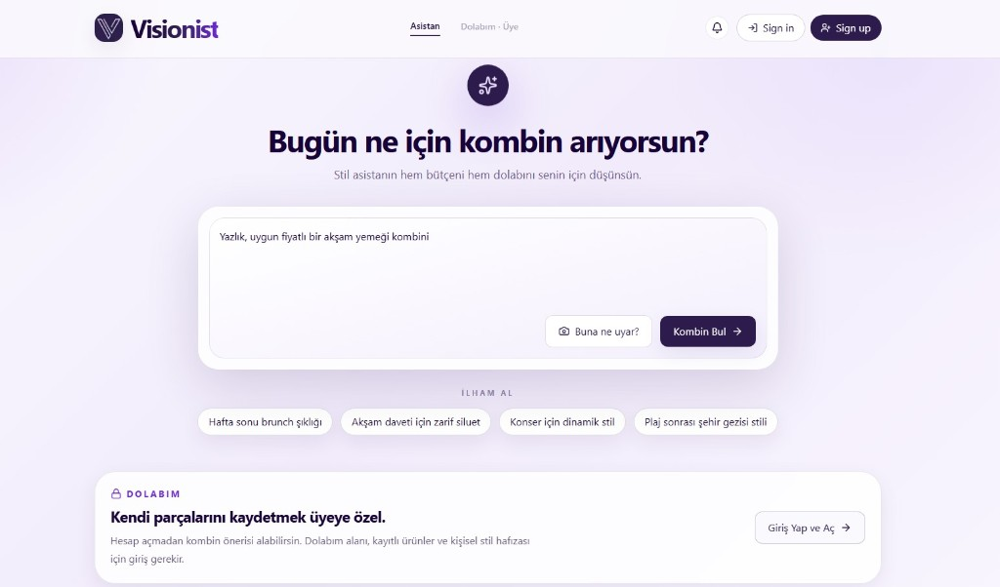

**Fit modu:** Parça fotoğrafı yüklediğinizde asistan, eksik parçaları tamamlayacak öneriler üretir (JPEG, PNG veya WebP; en fazla 8 MB).

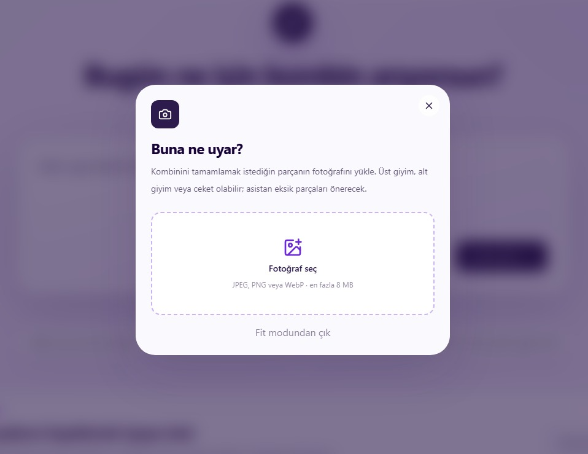

---

### Giriş, kayıt veya misafir devam

**Sign in** ve **Sign up** ile üyelik hesabı açabilirsiniz. İsterseniz **“Hesap olmadan devam et”** ile misafir olarak da kombin alırsınız — hesap yalnızca kayıtlı profil ve **Dolabım** için gerekir.

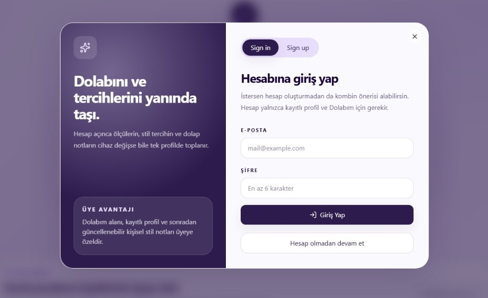

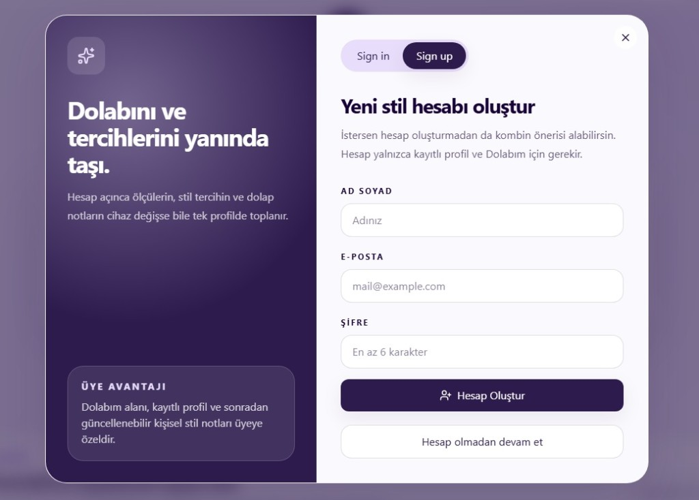

---

### Kombin sonucu — Akıllı Kolaj

Gemini seçimi tamamlandığında **“Senin için seçilen kombin”** kartı açılır: parçalar yan yana kolajda, toplam fiyat ve tasarruf özetiyle sunulur. Yüklediğiniz parça **“Senin parçan”** etiketiyle ayrıca gösterilir.

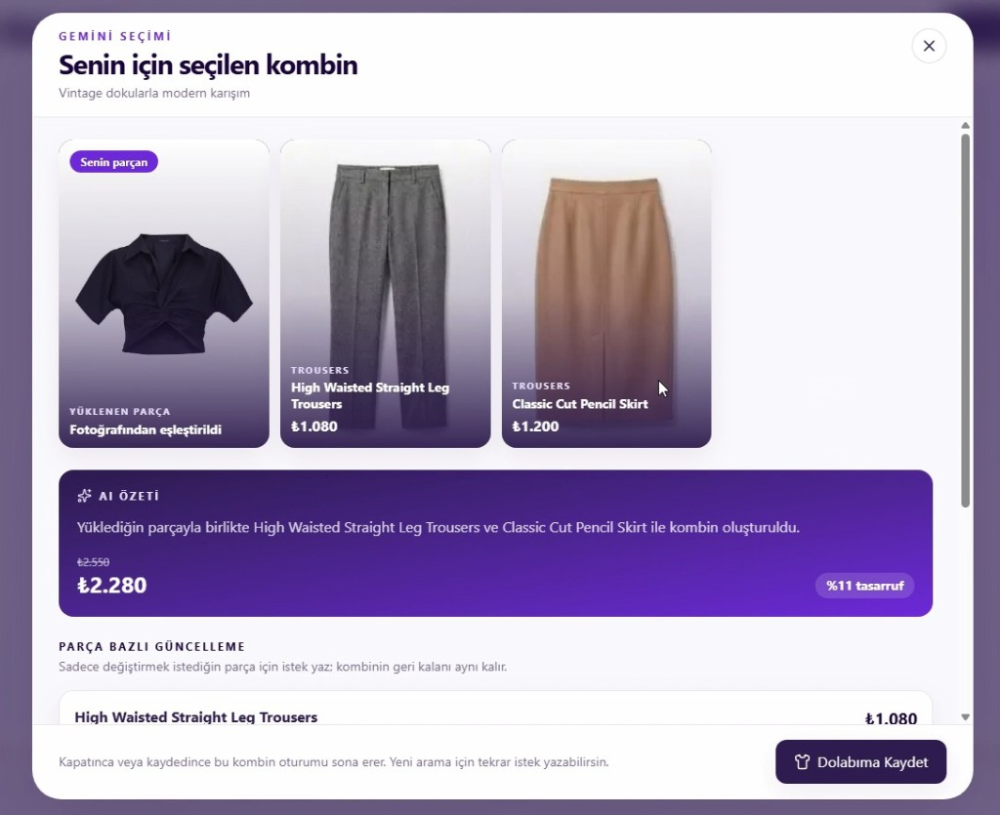

**Parça bazlı güncelleme:** Beğenmediğiniz tek bir parça için kısa bir not yazın (*“farklı bir pantolon önerir misin”*); kombinin geri kalanı korunur, yalnızca o parça yenilenir.

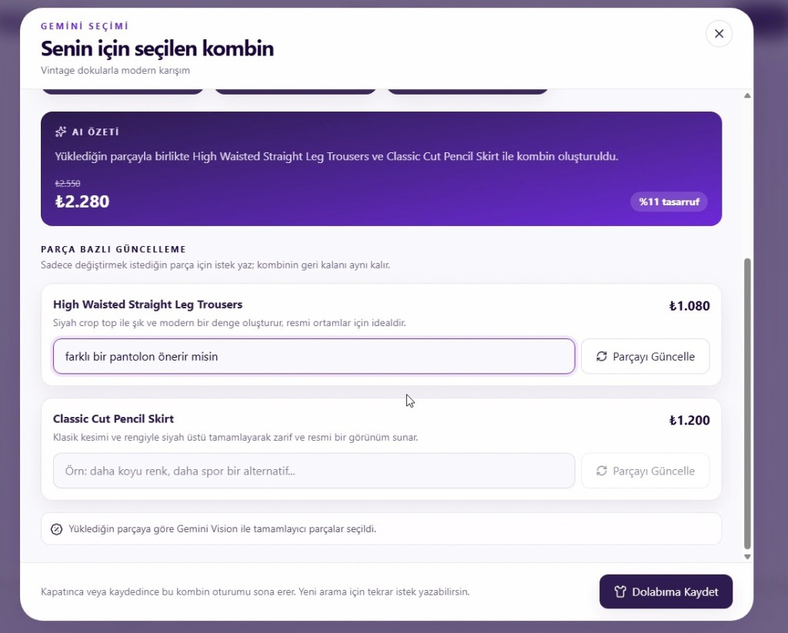

---

### Dolabım — kayıtlı kombinler

Üye olarak **“Dolabıma Kaydet”** dediğiniz kombinler **Dolabım** sayfasında listelenir. Her kayıt tarih, başlık ve toplam fiyatla birlikte görünür; istemediğiniz seti **silebilirsiniz**.

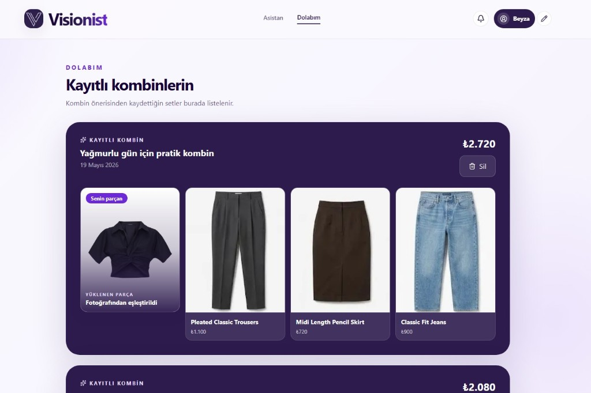

---

### Profil ve hesap ayarları

**Profil bilgileri** ekranından cinsiyet, beden, segment ve stil tercihlerinizi sonradan güncelleyebilirsiniz. Öneri motoru her yeni istekte bu bilgileri kullanır.

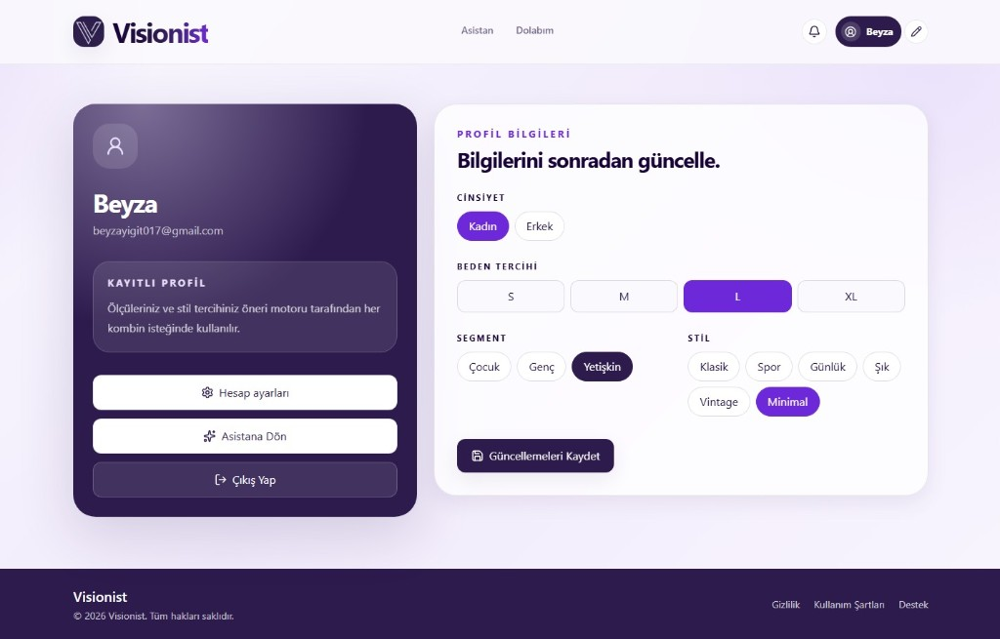

**Hesap ayarları**ndan görünen adınızı düzenleyebilir, şifrenizi değiştirebilir veya hesabınızı kalıcı olarak silebilirsiniz (profil, kombin geçmişi ve dolap kayıtları silinir).

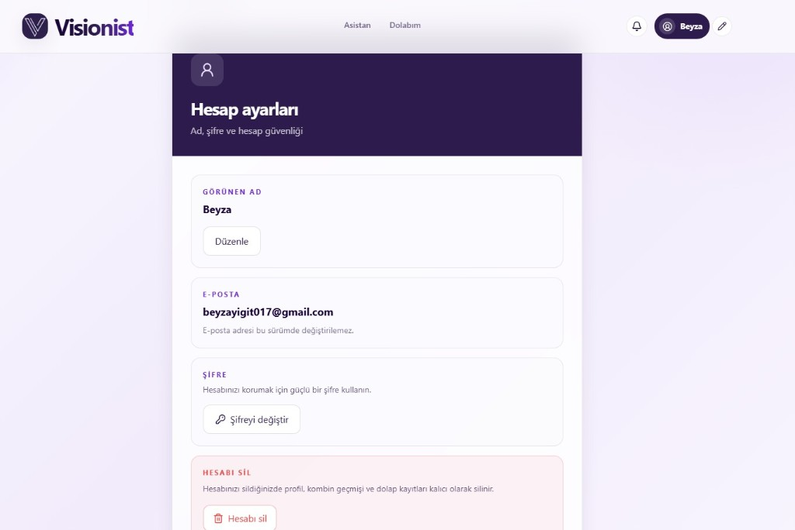

---

## Misafir ve üye farkı

| Özellik | Misafir | Üye (giriş yapmış) |
|--------|---------|---------------------|
| Onboarding ve kombin önerisi | ✅ | ✅ |
| Metin veya fotoğrafla kombin | ✅ | ✅ |
| Kombin sonucunu görüntüleme | ✅ | ✅ |
| Parça bazlı güncelleme | ✅ | ✅ |
| **Dolabıma kaydet** | ❌ | ✅ |
| **Dolabım** sayfası | ❌ | ✅ |
| Profil / hesap ayarları | ❌ | ✅ |
| Tercihlerin cihazlar arası saklanması | Sınırlı | ✅ (Supabase) |

Özet: **Misafir olarak sohbeti kullanır, kombini görürsünüz; kaydetmek için üye olmanız gerekir.**

---

## Teknik mimari

| Katman | Teknoloji | Görev |
|--------|-----------|--------|
| Arayüz | **Next.js**, **Tailwind CSS**, TypeScript | Onboarding, asistan, kolaj, dolap |
| API proxy | Next.js Route Handler (`/api/backend`) | Backend’e güvenli yönlendirme |
| Backend | **FastAPI**, Python 3.11+ | Öneri, profil, gardırop API |
| Yapay zeka | **Google Gemini 2.5 Flash** | Stil seçimi (JSON / ürün ID) |
| Veri | **Supabase** (Auth, PostgreSQL, Storage) | Kullanıcı, profil, kombin geçmişi |
| Katalog | `backend/data/products.json` + `frontend/public/images` | Yerel ürün ve görseller |

**Öneri hattı (kısa):** Profil + stok kuralları → aday ürün listesi → Gemini → ID listesi → frontend kolaj.

---

## Yerel kurulum

### Gereksinimler

- Node.js 18+
- Python 3.11+
- Supabase projesi (migration’lar `supabase/migrations/` altında)
- Google AI Studio **GEMINI_API_KEY**

### 1. Backend

```bash
cd backend
python -m venv .venv
# Windows: .venv\Scripts\activate
pip install -r requirements.txt
cp .env.example .env   # değerleri doldurun
uvicorn app.main:app --reload --host 127.0.0.1 --port 8000
```

### 2. Frontend

```bash
cd frontend
npm install
cp .env.example .env.local   # değerleri doldurun
npm run dev
```

Tarayıcı: [http://localhost:3000](http://localhost:3000)

### 3. Supabase migration’ları

`supabase/migrations/` dosyalarını sırayla Supabase SQL Editor’da çalıştırın veya Supabase CLI ile projeye uygulayın.

---

## Ortam değişkenleri

`.env` dosyaları repoya **dahil edilmez**. Örnekler:

**`backend/.env`** — bkz. `backend/.env.example`

| Değişken | Açıklama |
|----------|----------|
| `GEMINI_API_KEY` | Google Gemini API anahtarı |
| `GEMINI_MODEL` | Varsayılan: `gemini-2.5-flash` |
| `SUPABASE_URL` | Supabase proje URL |
| `SUPABASE_SERVICE_ROLE_KEY` | Backend için (gizli) |

**`frontend/.env.local`** — bkz. `frontend/.env.example`

| Değişken | Açıklama |
|----------|----------|
| `NEXT_PUBLIC_SUPABASE_URL` | Supabase URL |
| `NEXT_PUBLIC_SUPABASE_ANON_KEY` | Anon public key |
| `NEXT_PUBLIC_USE_LIVE_API` | `true` |
| `NEXT_PUBLIC_API_URL` | `/api/backend` |
| `BACKEND_URL` | `http://127.0.0.1:8000` (yerel) |

Canlı ortamda `BACKEND_URL`, deploy ettiğiniz FastAPI adresini göstermelidir (ör. Render).

---

## Proje yapısı

```text
BTK_Hackathon/
├── frontend/          # Next.js arayüz
├── backend/           # FastAPI + katalog + recommender
│   └── data/          # products.json
├── supabase/          # Veritabanı migration’ları
└── docs/screenshots/  # README görselleri
```

---

## Canlı yayın (özet)

1. **Backend** — Render / Railway vb. (`backend/`, `requirements.txt`)
2. **Frontend** — Vercel (`frontend/`, root directory: `frontend`)
3. **Supabase** — Auth redirect URL’lerine canlı site adresini ekleyin
4. Vercel’de `BACKEND_URL` = Render API adresiniz

> Vercel Hobby planında sunucu fonksiyonu süresi sınırlı olabilir; uzun fit analizlerinde ilk istek yavaş gelebilir (Render soğuk başlangıcı + model süresi).

---

## Ekip

Altair — **Visionist**  
Stil asistanınız; bütçenizi ve dolabınızı sizin yerinize düşünür.

---

Sitemizi incelemek için: https://visionistassistant.vercel.app/

