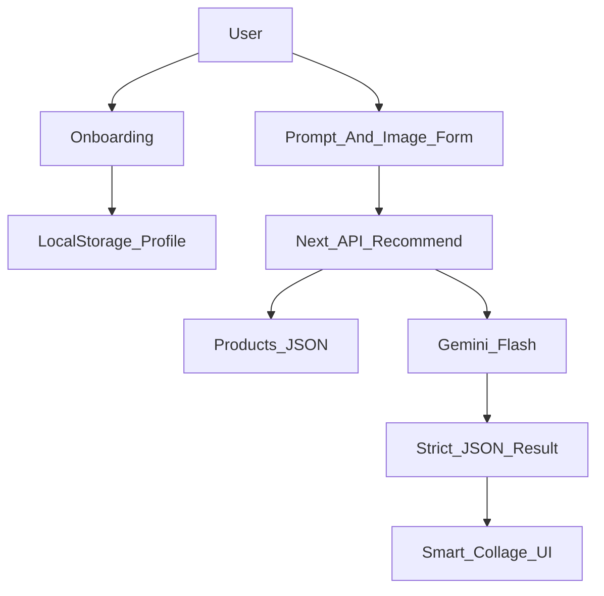

# AI Kombin Asistanı Web Sitesi Planı

## 1. Proje Hedefi

Bu proje, e-ticaret ürün kataloğundaki mevcut stoktan kullanıcı profiline göre ekonomik ve stil açısından uyumlu kombinler öneren bir yapay zeka destekli web asistanıdır.

Kullanıcı; segmentini, fiziksel özelliklerini, stil tercihini ve ihtiyacını girer. Sistem, ürün kataloğunu filtreler, Gemini ile en uygun 3-4 parçalık kombini seçer ve sonucu görsel bir kolaj olarak gösterir.

## 2. MVP Kapsamı

İlk sürümde hedef, hackathon demosu için uçtan uca çalışan sade ama etkileyici bir deneyim oluşturmaktır.

MVP özellikleri:

- Segment seçimi: Çocuk, Genç, Yetişkin.
- Fiziksel profil: Boy, kilo ve stil tercihi.
- Metin tabanlı kombin isteği.
- Opsiyonel görsel yükleme alanı.
- Gemini destekli kombin önerisi.
- Ürün görsellerinden oluşan smart collage.
- Ürün fiyatı, indirimli fiyatı, tasarruf bilgisi ve kısa AI gerekçesi.
- Profil bilgilerinin LocalStorage ile saklanması.

## 3. Önerilen Teknoloji Yığını

Bu proje için önerilen ana framework Next.js 14+ App Router'dır.

Neden Next.js?

- Frontend ve backend API endpointleri aynı projede yönetilebilir.
- Gemini API key frontend'e sızmadan server tarafında kullanılabilir.
- Vercel ile ücretsiz ve hızlı deploy edilebilir.
- Tailwind CSS ve shadcn/ui ile hızlı, modern arayüz geliştirilebilir.
- İleride Supabase veya gerçek e-ticaret entegrasyonuna geçiş kolaydır.

Önerilen stack:

- Framework: Next.js 14+ App Router
- Dil: TypeScript
- UI: Tailwind CSS + shadcn/ui
- AI: Google Gemini 1.5 Flash
- Veri: MVP için `public/data/products.json`
- Görseller: `public/images/{id}.jpg`
- Hosting: Vercel

Alternatif olarak Vite + React daha hafif bir frontend sağlar; ancak AI API çağrılarını güvenli tutmak için ayrıca backend gerekir. Bu nedenle MVP için Next.js daha dengeli bir tercihtir.

## 4. Önerilen Proje Yapısı

```text
app/
  page.tsx
  api/
    recommend/
      route.ts
components/
  onboarding/
  recommendation/
lib/
  gemini.ts
  products.ts
  types.ts
public/
  data/
    products.json
  images/
    {id}.jpg
```

Temel sorumluluklar:

- `app/page.tsx`: Ana kullanıcı akışı ve adım yönetimi.
- `app/api/recommend/route.ts`: Gemini çağrısı ve öneri üretimi.
- `components/onboarding`: Segment, boy, kilo ve stil formları.
- `components/recommendation`: Prompt formu, sonuç kartları ve kolaj.
- `lib/products.ts`: Ürün filtreleme ve katalog yardımcıları.
- `lib/gemini.ts`: AI prompt hazırlığı ve Gemini entegrasyonu.
- `lib/types.ts`: Ürün, kullanıcı profili ve öneri tipleri.

## 5. Veri Modeli

PRD'deki `styles.csv` yapısı MVP için JSON formatına dönüştürülmelidir.

Temel ürün alanları:

- `id`
- `gender`
- `masterCategory`
- `subCategory`
- `articleType`
- `baseColour`
- `usage`
- `price`
- `sale_price`

Önerilen ek alanlar:

- `discountRate`: İndirim oranı.
- `imagePath`: Ürün görsel yolu.
- `productUrl`: Varsa satın alma veya detay linki.

Bu ek alanlar frontend'i sadeleştirir ve AI seçim kalitesini artırır.

## 6. Kullanıcı Akışı



Akış:

1. Kullanıcı segmentini seçer.
2. Boy, kilo ve stil bilgilerini girer.
3. Kombin ihtiyacını metin olarak yazar.
4. İsterse bir ürün fotoğrafı yükler.
5. API, ürünleri segment ve stile göre filtreler.
6. Gemini, kısa liste içinden ekonomik ve uyumlu kombin seçer.
7. Frontend, seçilen ürünleri kolaj olarak gösterir.

## 7. AI Öneri Stratejisi

Gemini'ye tüm ürün kataloğunu göndermek yerine önce uygulama içinde kısa liste hazırlanmalıdır.

Önerilen filtreleme:

- Segment eşleşmesi:
  - Çocuk: `Boys`, `Girls`
  - Genç/Yetişkin: `Men`, `Women`
- Kullanım amacı:
  - Casual
  - Smart Casual
  - Ethnic
  - Sports
- Kombin dengesi:
  - Üst giyim
  - Alt giyim
  - Ayakkabı
  - Aksesuar
- Ekonomi:
  - Yüksek indirim oranı
  - Düşük toplam fiyat

Gemini'den yalnızca JSON formatında yanıt istenmelidir:

```json
{
  "items": [
    {
      "id": 123,
      "reason": "Renk ve kullanım amacı uyumlu, indirim oranı yüksek."
    }
  ],
  "summary": "Toplam fiyatı düşük tutan günlük kombin."
}
```

Bu yaklaşım hem maliyeti düşürür hem de hatalı veya alakasız ürün seçme riskini azaltır.

## 8. Uygulama Aşamaları

1. Next.js, Tailwind CSS ve shadcn/ui ile proje kurulumu yapılır.
2. CSV verisi JSON formatına dönüştürülür.
3. Ürün görselleri `public/images` altında `id.jpg` formatında eşlenir.
4. Onboarding ekranları geliştirilir.
5. Kombin isteği formu oluşturulur.
6. API route içinde ürün filtreleme ve Gemini entegrasyonu yapılır.
7. AI yanıtı doğrulanır ve frontend'e güvenli formatta döndürülür.
8. Smart collage ve ürün kartları geliştirilir.
9. Örnek promptlar, hata durumları ve mobil görünüm cilalanır.
10. Vercel deploy ve demo testi yapılır.

## 9. UI ve Deneyim Önerileri

Ana sayfa sade ve yönlendirici olmalıdır. Kullanıcının karşısına doğrudan şu tarz bir başlangıç çıkabilir:

```text
Bugün ne için kombin arıyorsun?
```

Örnek promptlar:

- Uygun fiyatlı yazlık akşam yemeği kombini.
- Okul için rahat ve ekonomik bir kombin.
- İş görüşmesi için sade ve şık bir kombin.
- Spor ama günlük hayatta da giyilebilecek bir kombin.

Sonuç ekranında gösterilmesi önerilen bilgiler:

- Ürün görseli.
- Ürün adı veya kategori bilgisi.
- Liste fiyatı.
- İndirimli fiyat.
- Tasarruf miktarı.
- AI'ın seçim gerekçesi.
- Toplam kombin fiyatı.

Ek özellik önerileri:

- Daha ucuz öner.
- Daha sportif yap.
- Daha şık yap.
- Benzer kombin getir.

## 10. Riskler ve Önlemler

Risk: Ürün fiyatı veya görseller eksik olabilir.  
Önlem: Demo için küçük ama temiz bir örnek katalog hazırlanmalı.

Risk: Gemini geçersiz JSON döndürebilir.  
Önlem: API tarafında JSON doğrulama ve hata mesajı eklenmeli.

Risk: Katalog büyürse yanıt süresi artabilir.  
Önlem: Gemini'ye yalnızca filtrelenmiş 30-80 ürünlük kısa liste gönderilmeli.

Risk: Görsel yükleme MVP'yi yavaşlatabilir.  
Önlem: İlk sürümde metin tabanlı öneri önceliklendirilmeli, görsel analiz ikinci aşamada açılmalı.

## 11. Başarı Kriterleri

- Kullanıcı 1 dakika içinde profilini girip kombin önerisi alabilmeli.
- Sistem 3-4 parçalık uyumlu ve ekonomik bir kombin önermeli.
- Sonuç ekranı görsel olarak etkileyici ve anlaşılır olmalı.
- Fiyat, indirim ve tasarruf bilgileri net görünmeli.
- Demo örnek veriyle uçtan uca çalışmalı.
- Kod yapısı ileride Supabase ve gerçek ürün linkleriyle genişletilebilir olmalı.

## 12. Son Öneri

Bu proje için en mantıklı başlangıç Next.js + JSON katalog + Gemini API mimarisidir.

Öncelik sırası şu olmalıdır:

1. Çalışan metin tabanlı kombin önerisi.
2. Şık smart collage sonucu.
3. Ekonomik fiyat/indirim vurgusu.
4. Görsel yükleme ve multimodal analiz.
5. Supabase veya gerçek e-ticaret entegrasyonu.
